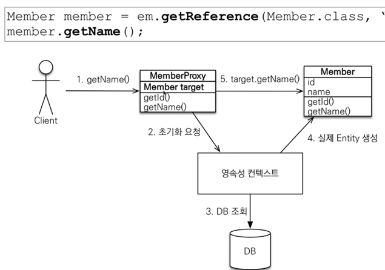

### 데이터베이스 방언

[persistence.xml](../src/main/resources/META-INF/persistence.xml) 파일 아래 코드 설명
```xml
<property name="hibernate.dialect" value="org.hibernate.dialect.H2Dialect"/>
```
 
```text
# jpa는 특정 데이터 베이스에 종속 X
# 각각의 데이터베이스가 제공하는 SQL 문법과 함수는 조금씩 다름
    - 가변 문자 : MySQL은 VARCHAR, Oracle은 VARCHAR2
    - 문자열을 자르는 함수 : SQL 표준은 SUBSTRING(), Oracle은 SUBSTR()
    - 페이징 : MySQL은 LIMIT, Oracle은 ROWNUM
# 방언 : SQL 표준을 지키지 않는 특정 데이터베이스만의 고유한 기능
````

#
### 영속성 컨텍스트 (EntityManager)
Transaction 기준으로 entity data를 저장해 놓는 일시적인 캐쉬라고 생각하면 될것 같음.
write(insert, update)할 SQL을 저장
EntityManager.persist(entity) =>  영속성 컨텍스트에 저장   
EntityManager.detach(entity) => 영속성 컨텍스트에서 제거  
EntityManager.remove(entity) => 커밋할때 db에서 제거

- 영속 엔티티의 동일성 보장
  - 1차 캐시로 반복 가능한 읽기(REPEATABLE READ) 등급의 트랜잭션 격리 수준을 데이터베이스가 아닌 애플리켕션 차원에서 제공 
- 쓰기 지연 SQL 저장소
- 1차 캐시
- 이점
  - 1차 캐시
  - entity 동일성 보장
  - 트랜잭션을 지원하는 쓰기 지연(transactional write-behind)
  - 변경 감지(dirty checking)
  - 지연 로딩(Lazy Loading)

#
### 플러시 (Flush)
영속성 컨텍스트의 변경내용을 데이터베이스에 반영   
: 영속성켄텍스트의 내용과 DB의 내용을 맞추는 작업이라고 보면 됨
- 플러시 작업 순서?
  - 변경감지 --> 수정된 엔티티 쓰기 지연 SQL 저장소에 등록 --> 쓰기 지연 SQL 저장소의 쿼리를 데이터베이스에 전송
- 플러시 발생
  - EntityManager.flush() : 직접 호출
  - 트랜잭션 커밋 : 자동 호출
  - JPQL 쿼리 실행 : 자동 호출
- 플러시 모드 옵션
  - FlushModeType.AUTO : 커밋이나 쿼리를 실행할 때 플러시(기본값) -> 가급적 변경하지 말고 사용하자
  - FlushModeType.COMMIT : 커밋할 때 만 플러시
- 영속성 컨텍스트를 비우지는 않음
- 트랜잭션이라는 작업 단위가 중요 : 커밋 직전에 동기화 하면 됨

#
### 준영속 상태
영속 상태의 엔티티가 영속성 컨텍스트에서 분리(detached)
영속성 컨텍스트가 제공하는 기능을 사용 못함
- 준영속 상태로 만들기
  - EntityManager.detach(entity) : 특정 엔티티만 준영속 상태로 전환
  - EntityManager.clear() : 영속성 컨텍스트 초기화 // 테스트시, 눈으로 쿼리를 확인하고 싶을 때 사용
  - EntityManager.close() : 영속성 컨텍스트를 종료

#
### @Entity
@Entity가 붙은 클래스는 JPA가 관리   
- 주의
  - 기본 생성자 필수(public or protected)
  - final 클래스, enum, interface, inner 클래스는 사용하면 안됨
  - 저장할 필드에 final 사용하면 안됨   

#
### hibernate.hbm2ddl.auto
  - create : 기존 테이블 삭제 후 다시 생성(drop+create)(사용X)
  - create-drop : create와 같으나 종료시점에 테이블 drop(사용X)
  - update : 변경분만 반영(운영X, test 서버에서만)
  - validate : 엔티티와 테이블이 정상 매핑되었는지만 확인
  - none : 사용하지 않음

#
### DDL 생성기능
ex ) @Column(nullable = false, length = 10)   
DDL 생성기능은 DDL을 자동 생성할 때만 사용되고, JPA의 실행 로직에는 영향을 주지 않는다.

#
### 필드와 컬럼 매핑

1. @Column
   1. name, insertable(insert 시 데이터반영여부), updatable(update 시 데이터 반영여부)
   2. nullable = false : not null
   3. unique : 잘 쓰이지 않음 -> constraint 이름이 랜덤으로 생성되어서, 로그등 파악에 문제가 발생할 확률이 높음  => @Table annotation에서 uniqueConstraints를 사용
   4. length, columnDefinition(데이터 베이스 컬럼 정보를 직접 줄 수 있다.)
   5. precision(소수점을 포함한 전체 자릿수), scale(소수점 자리수) : BigInteger, BigDecimal type에서 사용
2. @Enumerated
   1. EnumType.ORDINAL : 쓰지 않는 것이 좋음. 숫자로 표현, enum 인스턴스의 순서에 따라, integer값이 결정 되기 때문에, 쓰는 것을 추천하지 않음
   2. EnumType.STRING : 이것을 권장함
3. @Temporal
   1. 과거 데이터 베이스를 사용할 경우 사용
   2. LocalDate, LocalDateTime을 사용할 때는 생략가능(최신 하이버네이트에서 지원)
4. @Lob
   1. 매핑하는 필드 타입이 문자염 CLOB(String, char[], java.sql.CLOB) 매핑, 나머지는 BLOB(byte[], java.sql.BLOB) 매핑

#
### 기본 키 매핑

1. @Id : primary key, @GeneratedValue를 추가 안하면 직접 할당. 
2. @GeneratedValue : 자동으로 키 생성
   1. GenerationType.IDENTITY : 기본 키 생성을 데이터베이스에 위침(MySql은 auto_increment)
      1. Persist Context는 pk값으로 entity를 구분 : insert케이스 경우, DB에서 키값을 받아와야 하기 때문에, EntityManager.persist(entity)시 바로 insert실행
   2. GenerationType.SEQUENCE : 오라클, PostgreSQL등 에서 사용
      1. (H2: select next value for MBR_SEQ 실행) 
      2. Long 데이터타입 이상으로.
      3. Entity객체에 @SequenceGenerator(name="MEMBER_SEQ_GENERATOR", sequenceName = "MEMBER_SEQ") 와 같이 사용
      4. allocationSize : 미리 sequence를 증가시켜서 서버 메모리에서 매번 query를 실행하지 않고, id를 사용
   3. GenerationType.TABLE
      1. 키 생성 전용 테이블을 하나 만들어서 데이터베이스 시쿼스를 흉내내는 전략, 모든 DB에 적용가능하나, 성능상의 문제가 생길 수 있음(LOCK)

### 권장하는 식별자 전략
   1. 기본키 제약 조건 : null이 아님, 유일, 변하면 안된다.
   2. 미래까지 이 조건을 만족하는 자연키(ex.주민번호:성변환의 경우?, 주민번호 암호화 될 경우)는 찾기 어렵다. 대리키(대체키)를 사용하자.
   3. 권장 : Long형 + 대체키 + 키 생성전략 사용
   4. 비즈니스의 내용을 키로 가져오는 것을 권장하지 않음

#
### 연관 관계 매핑
   1. 단방향 연관관계 : @ManyToOne
   2. 양방향 연관관계 : @ManyToOne + @OneToMany(mappedBy = "team")  - Many=Member, One=Team
      1. mappedBy에는 Many가 되는 엔티티의 필드이름을 지정
      2. 객체에서는 단방향 관계 2개가 서로 엮여 있음
      3. 양방향 매핑시에 무한 루프를 조심하자 : ex. toString(), lombok, JSON 생성 라이브러리
         1. Spring Controller에서 entity를 반환하지 않게 한다 entity를 dto로 바꿔서 사용하자
      4. Many에 해당하는 entity의 fk 업데이트 문제가 있음
         1. Member의 Team이 변경 or Team의 member list에서 remove, add 할 때 해야하는지?
         2. 결론 : 둘 중 하나로 fk를 관리해야함 => 둘 중 하나를 연관관계의 주인으로 지정해야함
      5. (**_중요_**) 연관관계의 Owener
         1. 연관관계의 주임만이 외래 키를 관리(등록, 수정)
         2. 주인이 아닌쪽은 읽기만 가능 ( Team에서는 members를 읽기에만 사용한다. )
         3. 주인은 mappedBy 속성을 사용하지 않음
         4. 주인이 아니면 mappedBy 속성으로 주인 Entity의 필드 참조객체 지정
      6. **_가장 많이 하는 실수는 연관관계 주인에 값을 입력하지 않는 것_**
      7. 양쪽 entity에 참조값을 set해주는게 가장 베스트한 방법이다.
         1. 영속성 컨텍스트와 DB에 전부 값을 update를 해야함.
         2. 주인 entity의 field set method를 따로 편리하게 변경해 주는것이 좋다
         3. ``` java
             public void changeTeam(Team team) {
                if (this.team != null) {
                  this.team.getMembers().remove(this);
                }
                this.team = team;
                this.team.getMembers().add(this);
             }
            ```
   3. 정리
      1. 단방향 매핑만으로도 이미 연관관계 매핑은 완료 => 단방향 매핑으로 설계
      2. JPQL에서는 역방향으로 탐색할 일이 많음(entity로 데이터를 가져올때) : 양방향은 조회가 필요한 부분에서 사용
      3. 단방향 매핑을 잘하고 양방향은 필요할 때 추가하자

###
    1. 다대일 단방향 : @ManyToOne
    2. 다대일 양방향 : @ManyToOne + @OneToMany(mappedBy)
    3. 일대다 단방향 : @OneToMany => 추천하지 않음
        - One에 해당되는 Entity가 연관관계의 Owner
        - Many에 해당되는 Entity는 외래키를 관리하지 않지만, DB 테이블에서는 Many에 해당되는 entity의 테이블에서는 fk를 관리
        - One에 해당되는 Entity의 필드에 @JoinColumn 추가
        - @JoinColumn을 꼭 추가해야함 그렇지 않으면, 중간에 테이블이 하나 자동적으로 추가된다.
        - 단점 : 엔티티가 관리하는 외래 키가 다른 테이블에 있고, 연관관계 관리를 위해 추가로 update sql실행 
    4. 일대다 양방향 : 추천 X
        - Many에 해당되는 Entity에서 One의 참조는 읽기 전용으로 사용
    5. 일대일 : @OneToOne
        - 한 쪽 Entity에 @OneToOne 추가
        - 양방향으로 하면 다른 한쪽 Entity에서 @OneToOne 추가하고 mappedBy추가
        - 주 테이블에 외래 키 : 주 테이블만 조회해도 대상 테이블에 데이터가 있는지 확인이 가능하지만, 값이 없으면 외래 키에 null이 허용되어야 함
        - 대상 테이블에 외래키 : 주 테이블과 대상 테이블을 일대일에서 일대다 관계로 변경할 때 테이블 구조 유지가 가능하지만, 프록시 기능의 한계로 지연로딩으로 설정해도 항상 즉시 로딩됨
    6. 다대다 : @ManyToMany
        - 실무에서 쓰지 않음
        - RDB는 정규화된 테이블 2개로 다대다 관계를 표현할 수 없어서, 중간 연결 테이블이 생성됨
        - 연결 테이블을 추가해서 일대다, 다대일 관계를 풀어내야함
        - 객체는 다대다 관계가 가능하지만, 추천하지 않는다.
        - 여러 데이터가 들어 올 수 있으므로, 중간테이블이 결국 entity가 됨

#
### 상속관계 매핑
1. RDB에는 슈퍼타입 서브타입 관계라는 모델링 기법이 객체 상속과 유사
   1. @Inheritance(strategy)
   2. @DiscriminatorColumn : 부모 엔티티에 설정, 부모 엔티티 테이블에 type을 나타내는 컬럼이 생기고 entity명이 입력됨
   3. @DiscriminatorValue : 자식 엔티티에 설정, 부모 엔티티 테이블의 type컬럼에 엔티티 명대신, 저장될 값을 지정
2. 종류
   1. 단일 테이블 전략 : 한 테이블에 다 합쳐버림 => default 
      - @Inheritance(strategy = InheritanceType.SINGLE_TABLE)
      - DTYPE 컬럼이 기본으로 생성됨(@DiscriminatorColumn이 기본)
      - 장점 : 조인 X, 조회 성능이 빠름
      - 단점 : 자식 엔티티에 해당하는 컬럼들은 모두 null허용을 해야함(무결성X), 테이블이 커질수 있고, 상황에 따라서, 조회성능이 오히려 느려질 수 있다.
      
   2. 조인 전략 : 공통데이터(슈퍼타입) 테이블과 그 특별한 데이터(서브타입) 테이블을 분리해서 조인으로 데이터를 가져옴
      - @Inheritance(strategy = InheritanceType.JOINED)
      - 기본 정석 방식이라고 추천함
      - 장점 : 테이블 정규화, 외래 키 참조 무결성 제약조건 활용가능, 저장공간 효율화
      - 단점 : 조회시 조인을 많이 사용, 성능저하, 조회 쿼리가 복잡, 데이터 저장시 insert 2번 호출
      
   3. 구현 클래스마다 테이블 매핑 전략
       - @Inheritance(strategy = InheritanceType.TABLE_PER_CLASS)
       - 추천하지 않음 => 서로 묶이지 않음
       - 장점 : 서브 타입을 명확하게 구분해서 처리할 때 효과적, not null 제약조건 사용 가능
       - 단점 : 부모타입으로 조회할 경우, union으로 모든 테이블 데이터를 조회함 -> 느림
      

### @MappedSuperclass
1. 공통 매핑 정보가 필요할 때 사용(id, name)
2. DB랑 관련없이 객체에서 공통적인 부분을 사용하고 싶을 때, 사용
   
3. 상속관계 매핑X
4. 엔티티X, 테이블과 매핑X
5. 부모클래스를 상속 받는 자식클래스에 매핑 정보만 제공
6. 조회 검색 불가(em.find(BaseEntity.class) 불가)
7. 직접 생성해서 사용할 일이 없으므로 추상 클래스 권장
8. 테이블과 관계 없고, 단순히 엔티티가 공통으로 사용하는 매핑 정보를 모으는 일
9. 주로 등록일, 수정일, 등록자, 수정가 같은 전체 엔티티에서 공통으로 적용하는 정보를 모을 때 사용
10. 참고 : @Entity 클래스는 엔티티나 @MappedSuperclass로 지정한 클래스만 상속가능 


#
### 프록시
1. EntityManager.getReference()
    - DB 조회를 미루는 가짜(프록시) 엔티티 객체 조회
    - System.out.println("findMember class= "+ member.getClass()); => 출력 : findMember class= class hello.jpa.Member$HibernateProxy$8DIt0uSV
   
2. 프록시의 특징
   - 프록시 객체는 실제 객체의 참조(target)를 보관
   - 프록시 객체를 호출하면 프록시 객체는 실제 객체의 메소드 호출
   - 프록시 초기화 : 실제 사용할때(ex. entity.getName()), 프록시 객체는 영속성 컨텍스트에 초기화 요청하여, 실제 엔티티를 생성.
     
   - 프록시 객체는 처음 사용할 때 한 번만 초기화
   - 프록시 객체를 초기화 할 때, 프록시 객체가 실제 엔티티로 바뀌는 것은 아님, 초기화 되면 프록시 객체를 통해서 실제 엔티티에 접근가능
   - 프록시 객체는 원본 엔티티를 상속받음, 따라서 타입체크시 주의해야함(==비교실패, 대신 instance of 사용)
   - 영속성 컨텍스트에 찾는 엔티티가 이미 있으면 em.getReference()를 호출해도 실제 엔티티 반환
   - 영속성 컨텍스트의 도움을 받을 수 없는 준영속 상태일 때, 프록시 초기화 문제 발생(hibernate는 org.hibernate.LazyInitializationException 예외를 터트림)
   - **_결론_** : Entity를 영속성 컨텍스트에 초기화 할때, getReference로 하면 프록시 인스턴스로 셋팅 되고, find로 하면 entity 인스턴스로 셋팅됨.
3. 프록시 확인
   - 프록시 인스턴스의 초기화 여부 확인 : PersistenceUnitUtil.isLoaded(Object entity)
   - 프록시 클래스 확인 방법 : entity.getClass().getName()
   - 프로시 강제 초기화 : org.hibernate.Hibernate.initialize(entity)
   - 참고 : JPA 표준은 강제 초기화 없음


### 지연로딩
fetch = FetchType.LAZY
- 해당 참조 객체는 proxy로 가져옴
- proxy의 메소드를 사용할 때 초기화 됨
- 참조 객체 엔티티를 함께 자주 사용한다면, LAZY보다 fetch = FetchType.EAGER로 한다.
  : 이때, 참조 객체는 proxy 객체가 초기화된 실제 entity객체 이다. 
- 즉시 로딩을 적용하면 예상치 못 SQL이 발생
- 즉시 로딩은 JPQL에서 n+1문제를 일으킨다.   
  : JPQL로 entity의 리스트를 가져올 경우, 즉시 로딩의 객체의 참조 객체를 아이디 별로 find 쿼리가 실행된다.   
  : N개의 entity가 조회 되면, Eager 참조 entity객체를 초기화 하기 위해 N번의 쿼리가 더 실행됨   
  : fetch 조인을 하면 한번의 쿼리로 entity리스트를 초기화해서 가져옴
- @ManyToOne, @OneToOne은 default가 즉시 로딩 -> fetch = FetchType.LAZY로 변경 꼭!
- @OneToMany, @ManyToMany는 기본이 지연로딩
- **_실무에서는 가급적 지연 로딩만 사용, 즉시 로딩은 사용 안하는 것을 추천한다._**

### 영속성 전이 : CASCADE
cascade = CascadeType.PERSIST
- 특정 엔티티를 영속 상태로 만들 때, 연관된 엔티티도 한께 영속상태로 만들고 싶을 때 사용한다.
- 예를 들어, 부모 엔티티를 영속상태로 만들 때, 자식 엔티티도 같이 영속상태로 만든다.
- 주의 사항
  - 영속성 전이는 연관관계를 매핑하는 것과 아무 관련이 없음
  - 엔티티를 영속화할 때 연관된 엔티티도 함께 영속화하는 편리함을 제공할 뿐임
  - 라이프사이클이 같을 때 혹은 자식 엔티티가 한 부모 엔티티에서만 관리될 때만 사용하기를 권장(@ManyToOne(+@OneToOne)이 한개일때만)
- CascadeType.ALL : 모두 적용(라이프사이클 전부 동기화)
- CascadeType.PERSIST : 영속
- CascadeType.REMOVE : 삭제
- merge(병합), refresh, detach

### 고아 객체
orphanRemoval = true
- 부모 엔티티와 연관관계가 끊어진 자식 엔티티를 자동으로 삭제하는 기능
- 자식 엔티티를 컬렉션에서 제거되면 자동으로 자식 엔티티는 db에서 delete됨
- 참조가 제거된 엔티티는 다른 곳에서 참조하지 않는 고아 객체로 보고 삭제하는 기능
- **참조하는 곳이 하나일 때만 사용해야함**
- **특정 엔티티가 개인 소유할 때 사용**
- @OneToOne, @OneToMany만 가능
- 참고 : 개념적으로 부모를 제거하면 자식은 고아가 된다. 따라서 고아객체 제거 기능을 활성화 하면, 부모를 제거할 때 자식도 함께 제거된다. 이것은 CascadeType.REMOVE처럼 동작한다.


### 영속성 전이 + 고아객체, 생명주기
CascadeType.All + orphanRemoval=true
- 스스로 생명주기를 관리하는 엔티티는 EntityManager.persist()로 영속화, EntityManager.remove()로 제거
- 두 옵션을 모두 활성화 하면 부모 엔티티를 통해서 자식의 생명주기를 관리할 수 있음
- 도메인 주도 설계(DDD)의 Aggregate Root 개념을 구현할 때 유용


#
### Global Fetch 전략 설정
- 모든 연관관계를 지연 로딩으로
- @ManyToOne, @OneToOne은 기본이 즉시 로딩이므로 지연로딩으로 변경


# 값 타입
### JPA의 데이터 타입 분류
- 엔티티 타입
  - @Entity로 정의하는 객체
  - 데이터가 변해도 식별자로 지속해서 추적 가능
  - ex)회원 엔티티의 키나 나이 값을 변경해도 식별자(primary key)로 인식(추적) 가능
- 값 타입
  - int, Integet, String 처럼 단순히 값으로 사용하는 자바 기본 타입이나 객체
  - 식별자가 없고 값만 있으므로 변경시 추적 불가
  - 예) 숫자 100을 200으로 변경하면 완전히 다른 값으로 대체

### 값 타입 분류
- 기본값 타입
  - 자바 기본 타입(int, double)
  - 래퍼 클래스(Integer, Long)
  - String
  - 생명 주기를 엔티티에 의존
  - 값 타입은 공유하면 안된다(ex. 회원 이름 변경시 다른 회원의 이름도 함께 변경되면 안됨)
- 임베디드 타입(embedded type, 복합 값 타입)
  - ex. x, y 좌표등 custom하게
  - 새로운 값 타입을 직접 정의할 수 있음
  - jpa는 임베디드 타입이라 함
  - 주로 기본 값 타입을 모아 만들어서 복합 값 타입이라고도 함
  - int, String과 같은 값 타입
  - ex : 회원 엔티티는 이름, 근무기간(근무시작일+근무종료일), 주소(city+street+zipcode)의 근무기간, 주소처럼 구조체(struct)화
  - @Embeddable(값 타입을 정의하는 곳에 표시), @Embedded(값 타입을 사용하는 곳에 표시), 기본 생성자가  값 타입(collection value type)
  - 장점 : 재사용, 높은 응집도, Period.isWork()처럼 해당 값 타입만 사용하는 의미 있는 메소드를 만들 수 있음. 임베디드 타입을 포함한 모든 값 타입은, 값 타입을 소유한 엔티티에 생명주기를 의존함
  - 테이블 매핑
    
    - 임베디드 타입을 사용하기 전과 후에 매핑하는 테이블은 같다
    - 객체와 테이브을 아주 세밀하게(fine-grained) 매핑하는 것이 가능
    - **잘 설계한 ORM 애플리케이션은 매핑한 테이블의 수보다 클래스의 수가 더 많음**
  - 일반 엔티티처럼 다른 엔티티의 참조값을 가질 수 있다.
  - @AttributeOverride 속성 재정의
    - 한 엔티티에서 같은 임베디드 값 타입을 사용할 때 사용, 각각의 임베디드의 컬럼명이 중복되어서 임베디드 타입의 매핑 컬럼명을 재정의할 때 사용.
    - @AttributeOverrides, @AttributeOverride를 사용해서 컬럼명 속성을 재정의
  - 임베디드 타입의 값이 null이면 매핑한 컬럼 값 모두 null

### 값 타입과 불변 객체   
값 타입은 복잡한 객체 세상을 조금이라도 단순화 하려고 만든 걔념, 따라서 값 타입은 단순하고 안전하게 다룰 수 있어야 함

- 값 타입 공유 참조
  - 임베디드 타입 같은 (참조)값 타입(임베디드 클래스의 인스턴스)을 여러 엔티티에서 공유하면 위험함
  - side effect 발생
    
  - 여기에서는 버그를 발견하기도, 찾기도 쉽지 않다
  - 값타입을 복사하는 방법으로!!-> 습관으로 해야함
- 객체 타입의 한계
  - 항상 값을 복사해서 사용하면 공유참조로 인해 발생하는 부작용을 피할 수는 있다.
  - 문제는 임베디드 타입처럼 직접 정의한 값 타입은 자바의 기본타입이 아니라 객체 타입이다.
  - 자바 기본 타입에 값을 대입하면 값을 복사하지만, **객체 타입은 참조 값을 직접 대입하는 것을 막을 방법이 없다.**
  - 객체의 공유 참조는 피할 수 없다.
- 불변객체
  - 객체 타입을 수정할 수 없게 만들면 부작용을 원천 차단
  - **값 타입은 불변 객체(immutable object)로 설계해야함** (불변객체 : 생성시점 이후 절대 값을 변경할 수 없는 객체)
  - 생성자로만 값을 성정하고, 수정자(setter)를 만들지 않으면 됨
  - 참고 : Integer, String은 자바가 제공하는 대표적인 불변객체

### 값 타입의 비교
- 값 타입은 인스턴스가 달라도 그 안에 값이 같으면 같은 것으로 봐야함
- 동일성(identity) 비교 : 인스턴스의 참조 값(메모리 주소값)을 비교, == 사용
- 동등성(equivalence) 비교 : 인스턴스의 값을 비교. equals()사용
- 값 타입은 a.equals(b)를 사용해서 동등성 비교를 해야함
- 값 타입은 equals() 메소드를 적절하게 재정의(주로 모든 필드 사용)
- equals()랑 hashcode() 메소드를 재정의 할 때, 프록시 객체를 고려해야 하기 때문에, get메소드를 사용해야 한다.
  
  (인텔리J에서 Getter사용 제공)

### 값 타입 컬렉션
값 티입을 컬렉션에 담아서 사용, @ElementCollection, @CollectionTable

- 값 타입을 하나 이상 저장할 때 사용
- 데이터베이스는 컬렉션을 같은 테이블에 저장할 수 없다.
- 컬렉션을 저장하기 위한 별도의 테이블이 필요함
- @Entity와 다른점 : @Id(Primary key)가 없다
- 사용
  - 값 타입 컬렉션도 지연 로딩 전략을 사용하자
  - **값 타입 컬렉션은 영속성 전이, 고아 객체 제거 기능을 필수로 가진다.**
- 제약사항
  - 엑티티와 다르게 식별자가 없어서, 값을 변경하면 추적이 어렵다
  - 값 타입 컬렉션에 변경 사항이 발생하면, 주인 엔티티와 연관된 모든 데이터를 삭제하고, 값 타입 컬렉션에 있는 현재 값을 모두 다시 저장한다.
  - 값 타입 컬렙션을 매핑하는 테이블은 모든 컬럼을 묶어서 기본키를 구성해야 함 : **null 입력X, 중복 저장X**
- 대안
  - 제약사항이 운영에 어려움이 있기 때문에, 실무에서는 값타입 컬렉션 대신에 **일대다 관계**를 고려한다.
  - 일대다 관계를 위한 엔티티를 만들고, 여기에서 값 타입을 사용
  - 영속성 전이(Cascade)+고아 객체 제거를 사용해서 값 타입 컬렉션 처럼 사용
  - ex) AddressHistory Entity

### 값 타입 정리
  - 값 타입은 정말 값 타입이라 판단될 때만 사용
  - 엔티티와 값 타입을 혼동해서 엔티티를 값 타입으로 만들면 안됨
  - 식별자가 필요하고, 지속해서 값을 추적, 변경해야 한다면 그것은 값 타입이 아닌 엔티티로 하자


# 객체지향 쿼리 언어
- JPA의 다양한 쿼리 방법 : JPQL, JPA Criteria, QueryDSL, Native SQL, JDBC api 직접사용, MyBatis, SpringJdbcTemplate 함꼐 사용

### JPQL(Java Persistence Query Language)
- 가장 단순한 조회 방법
  - EntityManager.find()
  - 객체 그래프 탐색(a.getB().getC())
- JPA 사용 단점
  - 문제는 검색 쿼리 이다.
  - 검색을 할 때도 테이블이 아닌 엔티티 객체를 대상으로 검색, 모든 DB 데이터를 객체로 변환해서 검색하는 것은 불가능
  - 애플리케이션이 필요한 데이터만 DB에서 불러오려면 결국 검색 조건이 포함된 SQL이 필요하다.
- ANSI(American National Standards Institute - 미국국가표준협회) 표준 SQL문법 지원
- 엔티티 객체를 대상으로 쿼리 <-> SQL은 DB 테이블을 대상으로 쿼리
- SQL을 추상화해서 특정 데이터베이스 SQL에 의존 X
- JPQL을 한마디로 정의 하면 객체지향 SQL
- 동적 쿼리 작성에 어려움

### Criteria 소개
- 문자가 아닌 자바코드로 JPQL을 작성, JPQL 빌더 역할, 공식 기능
- 장점
  - 동적쿼리 생성하기 유용
  - 문법 오류를 컴파일 시점에서 잡음
- 단점
  - SQL 문법과 너무 다름, 유지보수의 어려움, 너무 복잡 & 실용성이 없음

### QueryDSL
- 문자가 아닌 자바코드로 JPQL을 작성할 수 있음
- jpql 빌더역할
- 컴파일 시점에 문법 오류를 찾을 수 있음
- 동적쿼리 작성 편리함
- 단순하고 쉬움, 실무 사용 권장

### 네이티브 SQL
- jpa가 제공하는 sql을 직접 사용하는 기능
- jpql로 해결할 수 없는 특정 데이터베이스에 의존적인 기능
- ex. 오라클 CONNECT BY, 특정 DB만 사용하는 SQL힌트

### JDBC 직접 사용, SpringJdbcTemplate등
- jpa를 사용하면서 jdbc 커넥션을 직접 사용하거나, 스프링 JdbcTemplate, 마이바티스등을 함께 사용 가능
- 단 영속성 컨텍스트를 적절한 시점에 강제로 플러시 필요
  - 한 트랜잭션에선 native query가 실행될때, flush가 자동으로 실행(repeatable read)
  - 그러나 다른 orm을 사용하는 등 다른 connection을 이용하여 조회할 때, 예상한 data가 read되지 않을 수 있다. 그래서 중간에 flush실행 필요
  - ex. jpa를 우회해서 sql을 실행하기 직전에 영속성 컨텍스트 수동 flush

# JPQL
- 객체지향 쿼리 언어, 테이블을 대상으로 쿼리하는 것이 아니라 **엔티티 객체를 대상으로 쿼리**한다.
- SQL을 추상화해서 특정 데이터베이스 SQL에 의존하지 않는다. 각각의 DB에 맞게 SQL로 변환

### 문법
- select m from Member as m where m.age>18
- 엔티티와 속성은 대소문자 구분함 (Member, age)
- JPQL 키워드는 대소문자 구분X(select, from, where)
- 엔티티 이름 사용, 테이블 이름 아님(Member)
- 별칭은 필수(m) (as는 생략가능)
- 집합과 정렬 함수 제공됨 : count(), sum(), avg(), max(), min()
- group by, having, order by

### TypeQuery, Query
- TypeQuery : 반환 타입이 명확할 때 사용
  ``` java
  TypedQuery<Member> query = EntityManager.createQuery("select m from Member m", Member.class);
  ```
- Query : 반환 타입이 명확하지 않을 때 사용
  ``` java
  Query query = EntityManager.createQuery("select m.username, m.age from Member m");
  ```

### 결과 조회 API
- query.getResultList() : 결과가 하나 이상일 때, 리스트 반환
  - 결과가 없으면 빈 리스트 반환
- query.getSingleResult() : 결고가 정확히 하나, 단일 객체 반환
  - 결과가 없으면 : javax.persistence.NoResultException -> Spring Data JPA에서는 null혹은 optional.empty 반환
  - 둘 이상이면 : javax.persistence.NonUniqueResultException

### 파라미터 바인딩 - 이름 기준, 위치 기준
- 이름 기준
    ``` java
  TypedQuery<Member> typedQuery1 = entityManager.createQuery("select m from Member m where m.username=:username", Member.class);
  typedQuery1.setParameter("username", "kim"); 
  ```

- 위치 기준 : 추천 안함
    ```java
  TypedQuery<Member> typedQuery1 = entityManager.createQuery("select m from Member m where m.username=?1", Member.class);
  typedQuery1.setParameter(1, "kim");
    ```
### 프로젝션(Projection)
- SELECT 절에 조회할 대상을 대상을 지정하는 것
- 프로젝션 대상 : 엔티티, 임베디드 타입, 스칼라 타입(숫자, 문자등 기본 데이터 타입)
  - SELECT m FROM Member m-> 엔티티 프로젝션
  - SELECT m.team FROM Member m -> 엔티티 프로젝션 : 묵시적 조인 방법 이라 사용을 지양한다.
  - SELECT m.address FROM Member m -> 임베디드 타입 프로젝션
  - SELECT m.username, m.age FROM Member m -> 스칼리 타입 프로젝션
  - DISTINCT로 중복제거
- 엔티티 프로젝션 대상으로 조회되는 엔티티는 영속성 컨텍스트에서 관리됨
- 여러 값 조회
    SELECT m.username, m.age FROM Member m
  1. Query 타입으로 조회
  2. Object[] 타입으로 조회 
      ``` java
        List<Object[]> resultList2 = entityManager.createQuery("select m.username, m.age from Member m")
                .getResultList();
      ```
  3. new 명령어로 조회
     - 단순 값을 DTO로 바로 조회
     - DTO객체의 패키지 명을 포함한 전체 클래스 명 입력
     - 순서와 타입이 일치하는 생성자 필요
     ```java
        List<MemberDto> dtoList = entityManager.createQuery("select new hello.jpql.dto.MemberDto(m.username, m.age) from Member m", MemberDto.class)
                .getResultList();
     ```

### 페이징 API
- JPA는 페이징을 다음 두 API로 추상화
- setFirstResult(int startPosition) : 조회 시작 위치(0부터 시작)
- setMaxResult(int maxResult) : 조회할 데이터 수
  ```java
    String jpqlStr = "select m from Member m order by m.age desc";
        List<Member> resultList = entityManager.createQuery(jpqlStr, Member.class)
                .setFirstResult(5)
                .setMaxResults(10)
                .getResultList();
  ```
  
### 조인
- 내부조인 : SELECT m FROM Member m [INNER] JOIN m.team t
- 외부조인 : SELECT m FROM Member m LEFT [OUTER] JOIN m.team t
- 세타조인 : select count(m) from Member m, Team t where m.username = t.name

### 조인 - ON 절
- ON절을 활용한 조인(JPA 2.1부터 지원)
- 조인 대상 필터링 가능
- 연관관계 없는 엔티티 외부 조인(하이버네이트 5.1부터)
- 조인 대상 필터링
  회원과 팀을 조인하면서, 팀 이름이 A인 팀만 조인
  - SQL : ``` SELECT m.*, t.* FROM Member m LEFT JOIN Team t ON m.TEAM_ID = t.id and t.name = 'A' ```
  - JPQL : ``` SELECT m, t FROM Member m LEFT JOIN m.team t on t.name = 'A' ```
- 연관관계 없는 엔티티 외부 조인
  회읜의 이름과 팀의 이름이 같은 대상 외부 조인
  - SLQ : ``` SELECT m.*, t.* FROM Member m LEFT JOIN Team t ON m.,username = t.name ```
  - JPQL : ``` SELECT m, t FROM Member m LEFT JOIN Team t on m.username = t.name ```

### 서브 쿼리
- 나이가 평균보다 많은 회원
  ``` select m from Member m where m.age > (select avg(m2.age) from Member m2) ```
- 한 건이라도 주문한 고객
  ``` select m from Member m where (select count(o) from Order o where m = o.member) > 0 ```
- 지원 함수
  - [NOT] EXISTS (subquery) : 서브 쿼리에 결과가 존재하면 참
    ``` select m from Member m where exists(select t from m.team t where t.name = 'teamA') ```
    - {ALL | ANY | SOME} (subquery)
    - ALL : 모두 만족하면 참
      ``` select o from Order o where o.orderAmount > ALL(select p.stockAmount from Product p) ```
    - ANY, SOME : 같은 의미, 조건을 하나라도 만족하면 참
      ```  select m from Member m where m.team = ANY(select t from Team t) ```
  - [NOT] IN (subquery) : 서브쿼리의 결과 중 하나라도 같은 것이 있으면 참
- JPA 서브 쿼리 한계
  - WHERE, HAVING 절에서만 서브 쿼리 사용 가능
  - SELECT 절도 가능(하이버네이트에서 지원)
  - FROM 절의 서브쿼리는 현재 JPQL에서 불가능
    - 조인으로 풀 수 있으면 풀어서 해결 or 쿼리를 2번 이상 사용

### JPQL 타입 표현 등
- 문자 : 'HELLO', 'She''s'
- 숫자 : 10L(Long), 10D(double), 10F(Float)
- Boolean : TURE, FALSE
- ENUM : jpabook.MemberType.Admin(패키지명 포함)
- 엔티티 타입 : TYPE(m) = Member(상속 관계에서 사용)
    ex) Item과 Book이 상속 관계일때,
    ```jpaql
      select i from Item i where type(i) = Book
    ```
- AND, OR, NOT
- =, >=, >, <, <=, <>
- BETWEEN, LIKE, IS NULL

### JPQL 조건식
- CASE
  1. 기본
  ```jpaql
    select
        case when m.age <= 10 then '학생요금'
        case when m.age >= 60 then '경로요금'
        else '일반요금'
    from Member m
  ```
  2. 단순
  ```jpaql
    select
        case t.name
            when '팀A' then '인센티브110%'
            when '팀B' then '인센티브120%'
            else '인센티브105%'
        end
    from Team t
  ```
  3. COALESCE : 하나씩 조회해서 null이 아니면 반환   
    사용자 이름이 없으면 이름 없는 회원을 반환
    ```jpaql
        select coalesce(m.username, '이름 없는 회원') from Member m 
    ```
  4. NULLIF : 두 값이 같으면 null 반환, 다르면 첫번째 값 반환   
     사용자 이름이 '관리자'면 null을 반환하고 나머지는 본인의 이름을 반환
    ```jpaql
        select NULLIF(m.username, '관리자') from Member m
    ```

### JPQL 기본 함수
- CONCAT
- SUBSTRING
- TRIM
- LOWER, UPPER
- LENGTH
- LOCATE : 문자열 시작 위치 찾아줌
- ABS, SQRT, MOD
- SIZE : 켈렉션의 갯수 ``` select size(t.members) from Team t``` 
- INDEX(JPA 용도)

### 사용자 정의 함수 호출
- 하이버네이트는 사용전 방언에 추가해야한다.
  - 사용하는 DB 방언을 상속받고, 사용자 정의 함수를 등록한다.
  ```jpaql
    select function('group_concat', i.name) from Item i
  ```
