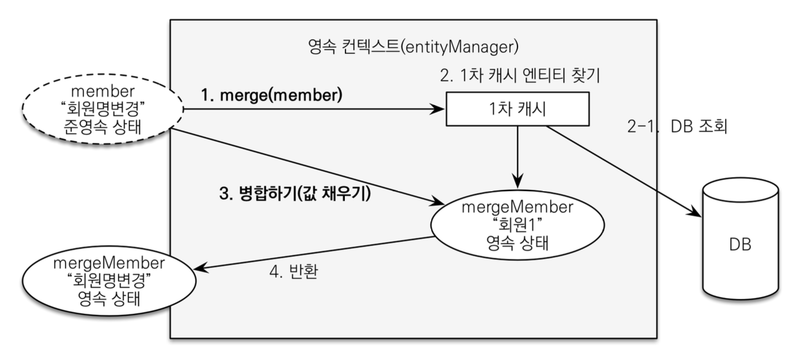

#### gradle
- 프로젝트 root directory/gradlew는 실행파일이다!! (' D')
  - ./gradlew dependencies : 프로젝트 라이브러리 의존관계를 출력한다.

#### hikari
- db connection pool
- spring-boot-starter default

#### logback
- logging
- slf4j(인터페이스 모음)의 구현체중 하나, 다른 하나 중 유명한거 log4j
- spring-boot-starter default

#### spring-boot-starter-test
- junit, mockito(mock객체 만드는 라이브러리), assertj 

#### spring-boot-devtools
- 개발시 도움, thymeleaf

#### repository에서 save된 객체를 return하지 않는 이유
- command랑 query를 분리해라? : side effect를 방지
- [예제 method](../src/main/java/jpabook/springjpashop/repository/MemberRepository.java) Long save(Member member){}

#### 로그 라이브러리
- p6spy : 파라미터를 위치에 적용시켜서 출력, but 운영에서는 성능을 저하 시킬수 있기때문에, 적용에 대해 고려해야한다.

#### 외래 키가 있는 곳을 연관관계의 주인으로 정해라
- 연관관계의 주인은 단순히 외래 키를 누가 관리하냐의 문제이지 비즈니스상 우위에 있다고 주인으로 정하면 안된다.

#### 엔티티 클래스 개발 
- Getter, Setter
  - 이론적으로 Getter, Setter 모두 제공하지 않고, 꼭 필요한 별도의 메서드를 제공하는 것이 가장 이상적
  - 하지만, 실무에서 엔티티의 데이터는 조회할 일이 너무 많으므로, Getter의 경우 모두 열어두는 것이 편리하다. 
  - Setter을 열어두고, setter 호출하면, 데이터가 변하기 때문에, 엔티티의 변경 추적이 어려워진다.
  - Setter 대신에, 변경지점이 명확하도록 변경을 위한 비즈니스 메서드를 별도로 제공하는 것이 안전한다.
- @ManyToMany : 실무에서는 사용X

#### 엔티티 설계시 주의점
- 가급적 Setter를 사용하지 말자
- 모든 연관관계는 지연로딩으로 => 매우매우 중요
- 컬렉션은 필드에서 초기화 하자(null 문제에서 안전하다) : 하이버네이트에서 영속화 하면 엔티티가 wrapping됨, collection 필드를 잘못 생성하면, 하이버네이트의 내부 메커니즘에 문제가 발생할 수도 있음
- 테이블, 컬럼명 생성 전략 : 하이버네이트는 필드명 그대로 사용, 스프링부트 신규 설정(카멜 -> 스네이크, . -> _ , 대문자 -> 소문자 => SpringPhysicalNamingStrategy)

#### Cascade의 범위
- 명확하게 하기는 어렵지만, 관리 주체가 되는 엔티티가
- 여기 코드(설계)에서는 Delivery와 OrderItem은 Order에서만 사용 관리, 다른 곳에서 참조하지 않음
- 이런 설계, 개념이 잘 이해가 가지 않는다면, 사용하지 않고, 나중에 리팩토링을 하는 것이 안전함

### 도메인 모델 패턴 vs 트랜잭션 스크립트 패턴
- 도메인 모델 패턴 : 엔티티가 비즈니스 로직을 가지고 객체 지향의 특성을 적극 활용하는 것, 서비스 계층은 단순히 엔티티에 필요한 요청을 위임하는 역할(jpa등 orm활용 할때)
- 트랜잭션 스크립트 : 엔티티에서는 비즈니스 로직이 거의 없고, 서비스 계층에서 대부분의 비즈니스 로직을 처리하는 것 (일반적으로 sql을 활용할때)
- 실무적으로 한 프로젝트 안에서도 두 패턴 모두 사용하는 경우도 많음

#### 엔티티를 form 등으로 활용하지 말자
- 엔티티를 form으로 사용하면, 화면에서 쓰이는 처리의 내용이 추가되게됨 -> 화면 종속적 기능이 생기므로 엔티티의 순수성이 해치면서 유지보수의 어려움이 증가한다.


#### 준영속 엔티티
- 영속성 컨텍스트가 더는 관리하지 않는 엔티티(생성된 객체)를 말한다.
- 영속성 컨텍스트가 생성하지 않고, 임의로 생성한 엔티티도 기존 식별자를 가지고 있으면 준영속 엔티티로 볼 수 있다.

#### 병합(merge)
- 
- entityManager.merge()로 실행해도, 파라미터로 넘긴 준영속 엔티티는 영속되지 않는다(영속성 컨텐스트가 감지하지 않는다.)
- 주의점 : 변경 감지 기능을 사용하면 원하는 속성만 선택해서 변경할 수 있지만, 병합을 사용하면 모든 속성이 변경된다.(병합은 모든 필드를 교체한다.)
- 잘못 데이터를 셋팅하면, 데이터 분실 위험이 크기 때문에, 머지사용을 지양하고, 변경감지를 사용한다.

#### 성능최적화
- 주의 1: 엔티티를 직접 노출할 때는 양방향 연관관계가 걸린 곳은 꼭! 한곳을 @JsonIgnore처리해야한다. 안그러면 양쪽을 서로 호출하면서 무한루프 발생
  - @JsonIgnore를 사용하면  Type definition error:... 발생 -> @..ToOne 필드에 프록시 객체로 미리 생성-> type변환시 에러 : Hibernate5Module사용(Spring boot 3에서는 javax대신 jakarta 사용으로 implement할 라이브러리가 다름)
- 주의 2: 지연로딩을 피하기 위해 즉시 로딩을 설정하면 안된다.
  - 즉시로딩이 필요한 경우 fetch join을 사용하자

#### Repository에서 DTO로 직접조회
```java
entityManager.createQuery("select new jpabook.jpashop.repository.order.simplequery.OrderSimpleQueryDto(o.id, m.name, o.orderDate, o.status, d.address)" +
        " from Order o" +
        " join o.member m" +
        " join o.delivery d", OrderSimpleQueryDto.class)
        .getResultList();
```
- 일반적으로 SQL을 사용할 때 처럼 원하는 값을 선택해서 조회, dto객체의 생성자 사용
- select 절에서 원하는 데이터만 직접 선택 -> app 네트웍용량 최적화(생각보다 미미함)
- 리포지토리 재사용성이 떨어짐
- api의 스펙이 repository에서 부터 정의 된다는 단점

## 쿼리 방식 선택 권장 순서
1. 우선 엔티티를 DTO로 변환하는 방법을 선택한다.
2. 필요하면 fetch join으로 성능을 최적화 한다. -> 대부분의 성능 이슈가 해결된다.
3. 그래도 안되면 DTO로 직접 조회하는 방법을 사용한다.
4. 최후의 방법은 JPA가 제공하는 네이티브 SQL이나 스프링 JDBC Template을 사용해서 SQL을 직접 사용한다.
