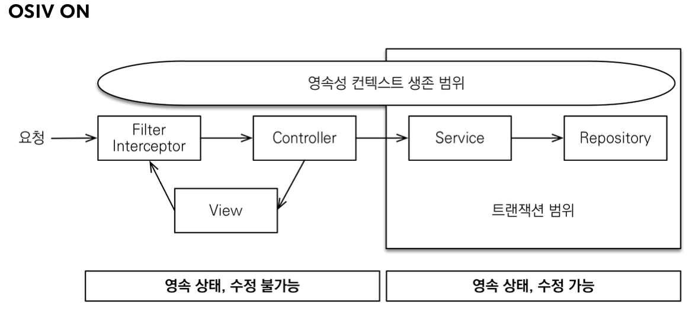

#### gradle
- 프로젝트 root directory/gradlew는 실행파일이다!! (' D')
  - ./gradlew dependencies : 프로젝트 라이브러리 의존관계를 출력한다.

#### hikari
- db connection pool
- spring-boot-starter default

#### logback
- logging
- slf4j(인터페이스 모음)의 구현체중 하나, 다른 하나 중 유명한거 log4j
- spring-boot-starter default

#### spring-boot-starter-test
- junit, mockito(mock객체 만드는 라이브러리), assertj 

#### spring-boot-devtools
- 개발시 도움, thymeleaf

#### repository에서 save된 객체를 return하지 않는 이유
- command랑 query를 분리해라? : side effect를 방지
- [예제 method](../src/main/java/jpabook/springjpashop/repository/MemberRepository.java) Long save(Member member){}

#### 로그 라이브러리
- p6spy : 파라미터를 위치에 적용시켜서 출력, but 운영에서는 성능을 저하 시킬수 있기때문에, 적용에 대해 고려해야한다.

#### 외래 키가 있는 곳을 연관관계의 주인으로 정해라
- 연관관계의 주인은 단순히 외래 키를 누가 관리하냐의 문제이지 비즈니스상 우위에 있다고 주인으로 정하면 안된다.

#### 엔티티 클래스 개발 
- Getter, Setter
  - 이론적으로 Getter, Setter 모두 제공하지 않고, 꼭 필요한 별도의 메서드를 제공하는 것이 가장 이상적
  - 하지만, 실무에서 엔티티의 데이터는 조회할 일이 너무 많으므로, Getter의 경우 모두 열어두는 것이 편리하다. 
  - Setter을 열어두고, setter 호출하면, 데이터가 변하기 때문에, 엔티티의 변경 추적이 어려워진다.
  - Setter 대신에, 변경지점이 명확하도록 변경을 위한 비즈니스 메서드를 별도로 제공하는 것이 안전한다.
- @ManyToMany : 실무에서는 사용X

#### 엔티티 설계시 주의점
- 가급적 Setter를 사용하지 말자
- 모든 연관관계는 지연로딩으로 => 매우매우 중요
- 컬렉션은 필드에서 초기화 하자(null 문제에서 안전하다) : 하이버네이트에서 영속화 하면 엔티티가 wrapping됨, collection 필드를 잘못 생성하면, 하이버네이트의 내부 메커니즘에 문제가 발생할 수도 있음
- 테이블, 컬럼명 생성 전략 : 하이버네이트는 필드명 그대로 사용, 스프링부트 신규 설정(카멜 -> 스네이크, . -> _ , 대문자 -> 소문자 => SpringPhysicalNamingStrategy)

#### Cascade의 범위
- 명확하게 하기는 어렵지만, 관리 주체가 되는 엔티티가
- 여기 코드(설계)에서는 Delivery와 OrderItem은 Order에서만 사용 관리, 다른 곳에서 참조하지 않음
- 이런 설계, 개념이 잘 이해가 가지 않는다면, 사용하지 않고, 나중에 리팩토링을 하는 것이 안전함

### 도메인 모델 패턴 vs 트랜잭션 스크립트 패턴
- 도메인 모델 패턴 : 엔티티가 비즈니스 로직을 가지고 객체 지향의 특성을 적극 활용하는 것, 서비스 계층은 단순히 엔티티에 필요한 요청을 위임하는 역할(jpa등 orm활용 할때)
- 트랜잭션 스크립트 : 엔티티에서는 비즈니스 로직이 거의 없고, 서비스 계층에서 대부분의 비즈니스 로직을 처리하는 것 (일반적으로 sql을 활용할때)
- 실무적으로 한 프로젝트 안에서도 두 패턴 모두 사용하는 경우도 많음

#### 엔티티를 form 등으로 활용하지 말자
- 엔티티를 form으로 사용하면, 화면에서 쓰이는 처리의 내용이 추가되게됨 -> 화면 종속적 기능이 생기므로 엔티티의 순수성이 해치면서 유지보수의 어려움이 증가한다.


#### 준영속 엔티티
- 영속성 컨텍스트가 더는 관리하지 않는 엔티티(생성된 객체)를 말한다.
- 영속성 컨텍스트가 생성하지 않고, 임의로 생성한 엔티티도 기존 식별자를 가지고 있으면 준영속 엔티티로 볼 수 있다.

#### 병합(merge)
- 
- entityManager.merge()로 실행해도, 파라미터로 넘긴 준영속 엔티티는 영속되지 않는다(영속성 컨텐스트가 감지하지 않는다.)
- 주의점 : 변경 감지 기능을 사용하면 원하는 속성만 선택해서 변경할 수 있지만, 병합을 사용하면 모든 속성이 변경된다.(병합은 모든 필드를 교체한다.)
- 잘못 데이터를 셋팅하면, 데이터 분실 위험이 크기 때문에, 머지사용을 지양하고, 변경감지를 사용한다.

#### 성능최적화
- 주의 1: 엔티티를 직접 노출할 때는 양방향 연관관계가 걸린 곳은 꼭! 한곳을 @JsonIgnore처리해야한다. 안그러면 양쪽을 서로 호출하면서 무한루프 발생
  - @JsonIgnore를 사용하면  Type definition error:... 발생 -> @..ToOne 필드에 프록시 객체로 미리 생성-> type변환시 에러 : Hibernate5Module사용(Spring boot 3에서는 javax대신 jakarta 사용으로 implement할 라이브러리가 다름)
- 주의 2: 지연로딩을 피하기 위해 즉시 로딩을 설정하면 안된다.
  - 즉시로딩이 필요한 경우 fetch join을 사용하자

#### Repository에서 DTO로 직접조회
```java
entityManager.createQuery("select new jpabook.jpashop.repository.order.simplequery.OrderSimpleQueryDto(o.id, m.name, o.orderDate, o.status, d.address)" +
        " from Order o" +
        " join o.member m" +
        " join o.delivery d", OrderSimpleQueryDto.class)
        .getResultList();
```
- 일반적으로 SQL을 사용할 때 처럼 원하는 값을 선택해서 조회, dto객체의 생성자 사용
- select 절에서 원하는 데이터만 직접 선택 -> app 네트웍용량 최적화(생각보다 미미함)
- 리포지토리 재사용성이 떨어짐
- api의 스펙이 repository에서 부터 정의 된다는 단점

## 쿼리 방식 선택 권장 순서
1. 우선 엔티티를 DTO로 변환하는 방법을 선택한다.
2. 필요하면 fetch join으로 성능을 최적화 한다. -> 대부분의 성능 이슈가 해결된다.
3. 그래도 안되면 DTO로 직접 조회하는 방법을 사용한다.
4. 최후의 방법은 JPA가 제공하는 네이티브 SQL이나 스프링 JDBC Template을 사용해서 SQL을 직접 사용한다.


#### fetch join
- sql이 1번만 실행되도 됨
- `distinct`를 사용한 이유는 1대다 조인이 있으므로 데이터베이스 row가 증가한다. 그 결과 같은 order 엔티티의 조회 수도 증가하게 된다. JPA의 distinct는 SQL에 distinct를 추가하고, 더해서 같은 엔티티가 조회되면, 애플리케이션에서 중복을 걸러준다(hibernate6버전이상에서는 자동으로 적용). 이 예에서 order가 컬렉션 페치 조인 때문에 중복 조회 되는 것을 막아준다.
- 단점 : 페이징 불가 `WARN - HHH90003004: firstResult/maxResults specified with collection fetch; applying in memory`
  - 1대다 fetch join은 페이징이 불가함
- 중요1 : 컬렉션 페치조인을 사용하면 페이징이 불가능. 모든 데이터를 db에서 읽어오고, 메모리에서 페이징을 해버림(메모리 터짐).
- 중요2 : 컬렉션 페치조인은 1개만 사용할 수 있다. 컬렉션 둘 이상에 페치조인을 사용하면 안된다. 데이터가 부정확하게 조회될 수 있다.


#### 페이징+컬렉션 엔티티 조회 문제 해결방법
1. *ToOne 관계는 모두 페치조인한다. *ToOne관계는 row수를 증가시키지 않으므로 페이징 쿼리에 영향을 주지 않는다.
2. 컬렉션은 지연로딩으로 조회한다.
3. 지연로딩 성능 최적화를 위해 `hibernate.default_batch_fetch_size`, `@BatchSize`를 적용한다.
  - hibernate.default_batch_fetch_size : 글로벌 설정
  - @BatchSize:개별 최적화
  - 이 옵션을 사용하면 컬렉션이나, 프록시 객체를 한꺼번에 설정한 size만큼 IN쿼리로 조회한다.

#### hibernate.default_batch_fetch_size, @BatchSize
- 장점
  1. 쿼리 호출 수가 `1+N`-> `1+1`로 최적화 된다
  2. 조인보다 DB데이터 전송량이 최적화 된다.(order와 orderItem을 조인하면 Order가 OrderItem만큼 중복해서 조회된다.)
  3. fetch join 방식과 비교해서 쿼리 호출 수가 약간 증가하지만, DB데이터 전송량이 감소한다.
  4. 컬렉션 페치 조인은 페이징이 불가능 하지만 이 방법은 페이징이 가능하다.
- 결론 : *ToOne 관계는 페치 조인해도 페이징에 영향을 주지 않는다. 따라서, ToOne관계는 페치조인으로 쿼리 수를 줄여서 해결하고, 나머지는 `hibernate.default_batch_fetch_size`로 최적화하자
- 참고 
  - `default_batch_fetch_size` 크기는 100~1000사이를 선택하는 것을 권장한다.(보통 in 절에 파라미터 max 갯수가 1000개)
  - 애플리케이션은 100이든 100이든 결국 전체 데이터를 로딩해야 하므로 메모리 사용량이 같다. 1000으로 설정하는 것이 성능상 가장 좋지만, 결국 DB든 애플리케이션이든 순간 부하를 어디까지 견딜 수 있는지로 결정하면 된다.


#### 엔티티가 중복되게 조회(엔티티 대신 dto로 생성) 최적화
- 장점 : Query 1번
- 단점 : DB에서 중복데이터가 추가되므로, 상황에 따라 쿼리2번 조회 보다 느릴수 있다. 애플리케이션에서 추가 작업, 페이징 불가


### 참고
```text
 개발자는 성능 최적화와 코드 복잡도 사이에서 줄타기를 해야 한다. 
 항상 그런 것은 아니지만, 보통 성틍 최적화는 단순한 코드를 복잡한 코드로 몰고 간다.

 엔티티 조회 방식은 jpa가 많은 부분을 최적화 해주기 때문에, 단순한 코드를 유지하면서, 성능을 최적화 할 수 있다.
 dto조회 방식은 sql을 직접 다루는 것과 유사하기 때문에, 둘 사이에 줄타기를 해야한다.
```

### DTO 조회 방식의 선택지
- 쿼리가 1번 실행된다고 항상 좋은 방법은 아니다
- 특정 주문 1건만 조회 하면 v4방식(*ToOne으로만 이루어진 fetch join후 collection들 조회)도 성능이 잘 나옴
- v5방식(*ToOne fetch join후 collection들을 in절을 사용하여 한꺼번에 조회, 메모리로 각각 collection set)은 코드가 복잡하지만, V4의 N+1문제 해결
- v6방식은 쿼리가 한번 실행되지만, order기준으로 페이징이 불가하다(OrderItem기준으로 가능)


### Open Session in View (OSIV)
- Open Session in View : 하이버네이트에서 명칭
- Open EntityManager in View : JPA에서 명칭
- 
- spring 시작할때 출력되는 warn로그 `2024-11-14T22:43:58.048+09:00  WARN 72896 --- [  restartedMain] JpaBaseConfiguration$JpaWebConfiguration : spring.jpa.open-in-view is enabled by default. Therefore, database queries may be performed during view rendering. Explicitly configure spring.jpa.open-in-view to disable this warning`
- spring.jpa.open-in-view:true -> 코드상 @Transactional범위를 벗어나도, DB connection을 유지함. entity의 lazy loading이 일어나는 시점이 @Transactional범위를 넘어가는 케이스가 있는 경우 필요
- spring.jpa.open-in-view의 default가 true여서, api응답이 끝날 때 까지(view template나 api controller등에서) 지연로딩이 가능했던 것
- 지연로딩은 영속성 컨텍스트가 생존해 있어야 하고, 영속성 컨텍스트는 기본적으로 db connection을 유지함
- 이 전략은 실시간 트래픽이 중요한 앱에서는 커넥션이 모자르는 경우가 생길수 있다.(장애발생)
- osiv를 false로 하면 모든 지연로딩을 트랜잭션안에서 처리해야한다.

###
##### 커맨드와 쿼리 분리
- 실무에서 osiv를 끈 상태로 복잡성을 관리하는 좋은 방법
- 보통 비즈니스 로직은 특정 엔티티 몇개를 등록하거나 수정하는 것이므로 성능이 크게 문제가 되지 않는다. 그런데 복잡한 화면을 출력하기 위한 쿼리는 화면에 맞추어 성능을 최적화 하는 것이 중요, 하지만 복잡성에 비해 핵심 비즈니스에 큰 영향을 주는 것은 아니다.
- 크고 복잡한 애플리케이션을 개발한다면, 이 둘의 관심사를 명확하게 분리하는 선택은 유지보수 관점에서 충분히 의미있다.
- ex: OrderService
  - OrderService : 핵심 비즈니스 로직
  - OrderQueryService : 화면이나 api에 맞춘 서비스(주로 읽기 전용 트랜잭션 사용)
- 고객 서비스는 실시간 api는 osiv를 끄고 admin처럼 커넥션을 많이 사용하지 않는 곳에서는 osiv를 켠다